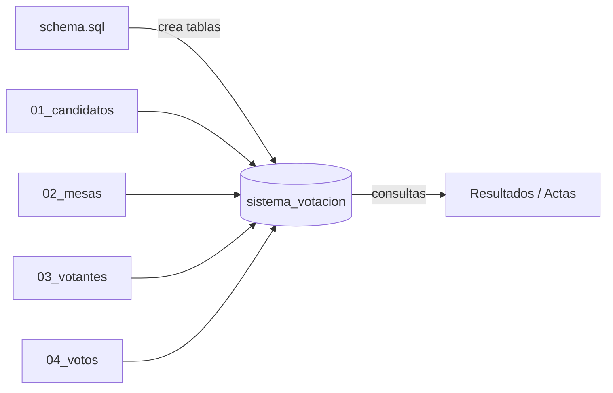
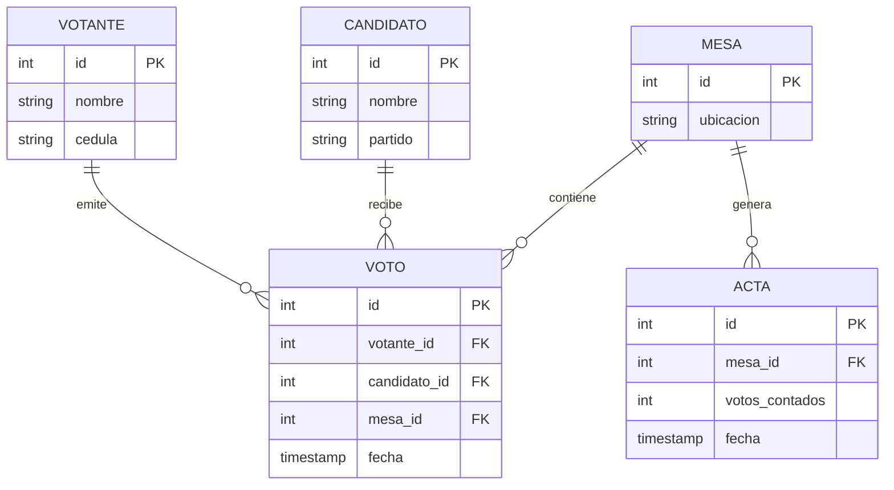

# Sistema de Votación PostgreSQL

Sistema de votación automatizado, implementado íntegramente en **PostgreSQL**, que simula un proceso electoral: registra votantes, candidatos, mesas y votos, y permite auditar los resultados.


## Tabla de Contenidos

- [Descripción](#descripción)
- [Características](#características)
- [Requisitos Previos](#requisitos-previos)
- [Instalación](#instalación)
- [Uso](#uso)
- [Estructura del Repositorio](#estructura-del-repositorio)
- [Modelo de Datos](#modelo-de-datos)
- [Contribución](#contribución)
- [Troubleshooting](#troubleshooting)
- [Roadmap](#roadmap)
- [Documentación](#documentación)
- [IA / Agentes](#ia--agentes)
- [Soporte](#soporte)
- [Autores](#autores)
- [Licencia](#licencia)

## Descripción

El objetivo del sistema es ofrecer una base de datos relacional, auditable y reproducible para gestionar una elección simulada. Toda la lógica vive en scripts SQL: un esquema (`db/schema.sql`) que define las tablas y un conjunto de datos semilla (`db/seeds/`) que pueblan el sistema con candidatos, mesas, votantes y votos de ejemplo.

Es un proyecto **educativo**: sirve para practicar diseño de esquemas, integridad referencial, consultas de agregación y auditoría de resultados sobre PostgreSQL.

### Flujo de carga



## Características

- ✅ Esquema relacional normalizado con integridad referencial (FK).
- ✅ Datos semilla realistas: 5 candidatos, 50 mesas, 1000 votantes y ~700 votos.
- ✅ Proceso de carga reproducible y ordenado por dependencias.
- ✅ Resultados auditables mediante consultas de agregación.
- 📋 Vistas y actas de verificación por mesa (planificado).

## Requisitos Previos

- **PostgreSQL**: v12 o superior.
- **psql** (o cualquier cliente SQL) para ejecutar los scripts.
- **Git** para clonar el repositorio.

## Instalación

### 1. Clonar el repositorio

```bash
git clone https://github.com/brayandiazc/sistema-votacion-postgresql.git
cd sistema-votacion-postgresql
```

### 2. Crear la base de datos y el esquema

`db/schema.sql` crea la base de datos `sistema_votacion`, se conecta a ella y define las tablas:

```bash
psql -U tu_usuario -f db/schema.sql
```

### 3. Cargar los datos semilla

Carga los seeds **en orden** (los votos dependen de votantes, candidatos y mesas):

```bash
psql -U tu_usuario -d sistema_votacion -f db/seeds/01_candidatos.sql
psql -U tu_usuario -d sistema_votacion -f db/seeds/02_mesas.sql
psql -U tu_usuario -d sistema_votacion -f db/seeds/03_votantes.sql
psql -U tu_usuario -d sistema_votacion -f db/seeds/04_votos.sql
```

## Uso

Conéctate a la base de datos y lanza consultas de auditoría:

```bash
psql -U tu_usuario -d sistema_votacion
```

```sql
-- Votos por candidato (ranking)
SELECT c.nombre, c.partido, COUNT(v.id) AS votos
FROM Candidatos c
LEFT JOIN Votos v ON v.candidato_id = c.id
GROUP BY c.id
ORDER BY votos DESC;

-- Participación por mesa
SELECT m.ubicacion, COUNT(v.id) AS votos_emitidos
FROM Mesas m
LEFT JOIN Votos v ON v.mesa_id = m.id
GROUP BY m.id
ORDER BY votos_emitidos DESC;
```

## Estructura del Repositorio

```text
.
├── db/
│   ├── schema.sql            # Crea la base de datos y las tablas
│   └── seeds/                # Datos semilla (cargar en orden numérico)
│       ├── 01_candidatos.sql
│       ├── 02_mesas.sql
│       ├── 03_votantes.sql
│       └── 04_votos.sql
├── docs/                     # Documentación (arquitectura, convenciones, ADRs)
├── specs/                    # Flujo ligero de especificaciones
└── .claude/                  # Subagentes y skills para asistentes de IA
```

## Modelo de Datos



Detalle completo en [`docs/architecture/database.md`](docs/architecture/database.md).

## Contribución

Lee la [Guía de Contribución](CONTRIBUTING.md) para el flujo de trabajo (Git Flow), el formato de commits (Conventional Commits) y el proceso de Pull Requests.

## Troubleshooting

#### Error: `database "sistema_votacion" already exists`

```bash
# Elimina la base de datos antes de recrearla (¡borra todos los datos!)
psql -U tu_usuario -d postgres -c "DROP DATABASE sistema_votacion;"
```

#### Error: `insert or update on table "votos" violates foreign key constraint`

Cargaste `04_votos.sql` antes que los demás seeds. Respeta el orden numérico de los archivos en `db/seeds/`.

## Roadmap

Próximos pasos en [`docs/product/roadmap.md`](docs/product/roadmap.md).

## Documentación

Toda la documentación vive en [`docs/`](docs/README.md):

| Documento                                                                | Responde a                   |
| ------------------------------------------------------------------------ | ---------------------------- |
| [`docs/architecture/architecture.md`](docs/architecture/architecture.md) | ¿Cómo está construido?       |
| [`docs/architecture/stack.md`](docs/architecture/stack.md)               | ¿Con qué tecnologías?        |
| [`docs/architecture/database.md`](docs/architecture/database.md)         | ¿Qué entidades y relaciones? |
| [`docs/conventions/`](docs/conventions/README.md)                        | ¿Cómo trabajamos en el repo? |
| [`docs/decisions/`](docs/decisions/README.md)                            | ¿Por qué cada decisión?      |

## IA / Agentes

Este repositorio está **listo para IA**. El contexto para agentes vive en [`AGENTS.md`](AGENTS.md) (canónico; [`CLAUDE.md`](CLAUDE.md) lo importa para Claude Code). Incluye [subagentes](.claude/agents) y [skills](.claude/skills) de ejemplo, y un flujo de especificaciones en [`specs/`](specs/README.md). Reglas en [`docs/conventions/ai-agents.md`](docs/conventions/ai-agents.md).

## Soporte

¿Problemas o sugerencias? Abre un issue en [el repositorio](https://github.com/brayandiazc/sistema-votacion-postgresql/issues) o escribe a brayandiazc@gmail.com.

## Autores

- **Brayan Diaz C** — _Trabajo inicial_ — [@brayandiazc](https://github.com/brayandiazc)

## Licencia

Este proyecto está bajo la licencia [MIT](LICENSE).

---

⌨️ con ❤️ por [@brayandiazc](https://github.com/brayandiazc)
