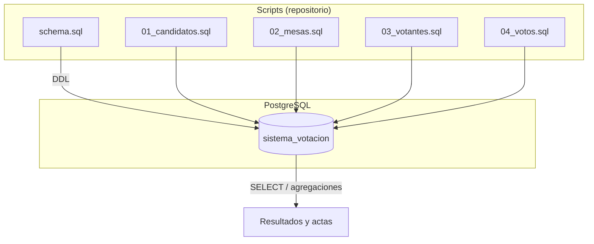
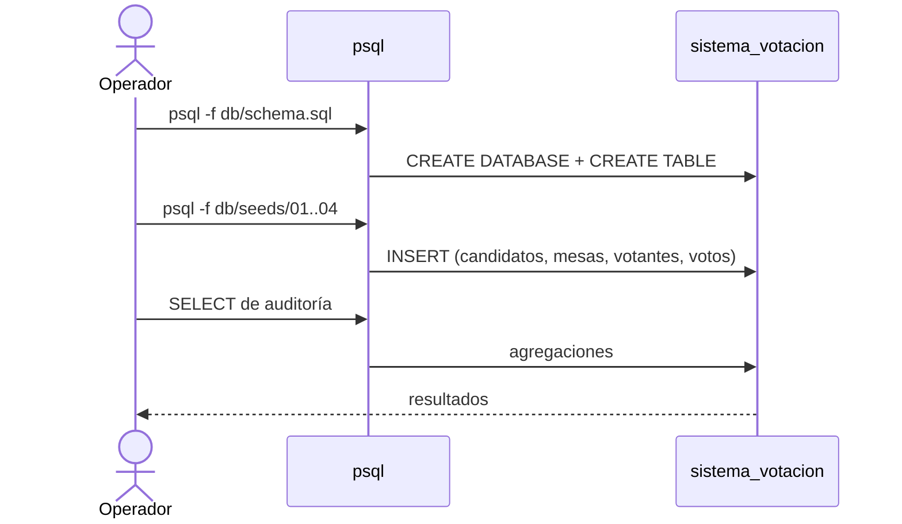

# Sistema de Votación PostgreSQL — Arquitectura

> Vista de alto nivel de cómo está construido el sistema. Para el stack real
> (versiones) ver [`stack.md`](stack.md). Para el modelo de datos ver
> [`database.md`](database.md).
>
> **Última actualización**: 2026-06-30

## Visión general

El proyecto es **SQL puro sobre PostgreSQL**: no hay capa de aplicación, API ni
servidor. Todo el sistema se compone de scripts `.sql` que se ejecutan con `psql`.

- `db/schema.sql` — crea la base de datos `sistema_votacion` y las tablas.
- `db/seeds/*.sql` — pueblan las tablas con datos de ejemplo, en orden de dependencia.
- Las consultas de auditoría se ejecutan ad hoc contra la base ya cargada.

## Diagrama

## Componentes

| Componente      | Responsabilidad                                          | Tecnología |
| --------------- | -------------------------------------------------------- | ---------- |
| `db/schema.sql` | Define base de datos, tablas, claves y relaciones (DDL). | SQL / DDL  |
| `db/seeds/`     | Carga datos de ejemplo en orden de dependencia (DML).    | SQL / DML  |
| Consultas       | Auditoría y resultados (agregaciones sobre las tablas).  | SQL        |

## Decisiones clave

| Decisión                        | Razón                                                         |
| ------------------------------- | ------------------------------------------------------------ |
| SQL puro, sin capa de aplicación | Foco educativo en modelado relacional y consultas.          |
| Seeds numerados (`01_`, `02_`…)  | Garantizar el orden de carga que respeta las claves foráneas. |
| PostgreSQL como único motor      | Integridad referencial robusta y disponibilidad amplia.     |

> El detalle y las alternativas de cada decisión relevante se registran como ADRs
> en [`../decisions/`](../decisions/README.md).

## Reglas no negociables

- Los seeds se cargan **en orden numérico**: candidatos y mesas antes que votos.
- Toda relación entre tablas se modela con **claves foráneas** explícitas.
- Ningún script debe asumir datos preexistentes que otro seed no haya cargado.

## Flujo de carga

## Referencias

- [`stack.md`](stack.md) — stack tecnológico y versiones.
- [`database.md`](database.md) — modelo de datos.
- [`../conventions/`](../conventions/README.md) — convenciones de trabajo.
