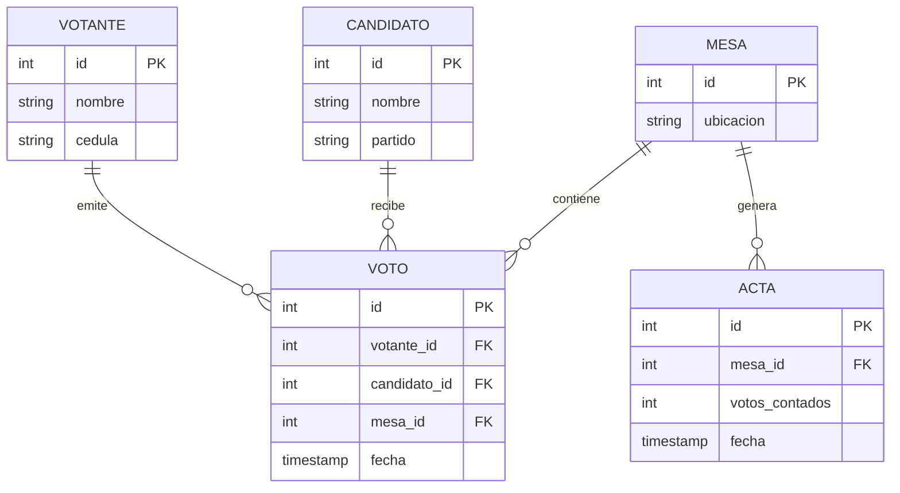

# Modelo de Datos

> Esquema, entidades y relaciones de **Sistema de Votación PostgreSQL**.
> Para las **reglas y estándares** de modelado (nomenclatura, tipos, índices)
> ver [`../conventions/database.md`](../conventions/database.md).
>
> **Última actualización**: 2026-06-30

## Diagrama Entidad-Relación

> La tabla `Actas` está definida en el esquema y reservada para las actas de
> verificación por mesa (ver [`../product/roadmap.md`](../product/roadmap.md)).

## Entidades principales

### Votantes

- **Propósito**: personas habilitadas para votar.
- **Campos clave**: `id` (SERIAL, PK), `nombre` (VARCHAR 100), `cedula` (VARCHAR 20, **UNIQUE**).
- **Relaciones**: 1:N con `Votos` (un votante puede tener votos asociados).

### Candidatos

- **Propósito**: opciones por las que se vota.
- **Campos clave**: `id` (SERIAL, PK), `nombre` (VARCHAR 100), `partido` (VARCHAR 100).
- **Relaciones**: 1:N con `Votos`.

### Mesas

- **Propósito**: mesas/centros electorales donde se emiten los votos.
- **Campos clave**: `id` (SERIAL, PK), `ubicacion` (VARCHAR 100).
- **Relaciones**: 1:N con `Votos` y 1:N con `Actas`.

### Votos

- **Propósito**: registro de cada voto emitido.
- **Campos clave**: `id` (SERIAL, PK), `votante_id` (FK), `candidato_id` (FK), `mesa_id` (FK), `fecha` (TIMESTAMP, default `CURRENT_TIMESTAMP`).
- **Relaciones**: N:1 hacia `Votantes`, `Candidatos` y `Mesas`.

### Actas

- **Propósito**: acta de verificación de los votos contados por mesa.
- **Campos clave**: `id` (SERIAL, PK), `mesa_id` (FK), `votos_contados` (INT), `fecha` (TIMESTAMP, default `CURRENT_TIMESTAMP`).
- **Relaciones**: N:1 hacia `Mesas`.

## Relaciones y cardinalidad

| Relación             | Cardinalidad | Notas                                   |
| -------------------- | ------------ | --------------------------------------- |
| Votantes → Votos     | 1:N          | `votos.votante_id` referencia `votantes.id`   |
| Candidatos → Votos   | 1:N          | `votos.candidato_id` referencia `candidatos.id` |
| Mesas → Votos        | 1:N          | `votos.mesa_id` referencia `mesas.id`         |
| Mesas → Actas        | 1:N          | `actas.mesa_id` referencia `mesas.id`         |

## Índices y restricciones

- `votantes.cedula` es **UNIQUE**: no se permite duplicar la cédula de un votante.
- Todas las claves foráneas de `Votos` y `Actas` se declaran con `REFERENCES`.
- Las PK `SERIAL` generan índice único automáticamente.

## Migraciones y versionado del esquema

- No hay herramienta de migraciones: el esquema vive en `db/schema.sql` y se aplica
  de forma idempotente recreando la base de datos. Ver
  [`../conventions/database.md`](../conventions/database.md).

## Datos semilla (seeds)

Se cargan con `psql -d sistema_votacion -f <archivo>` **en orden numérico**:

| Archivo                      | Tabla       | Volumen aprox. |
| ---------------------------- | ----------- | -------------- |
| `db/seeds/01_candidatos.sql` | Candidatos  | 5              |
| `db/seeds/02_mesas.sql`      | Mesas       | 50             |
| `db/seeds/03_votantes.sql`   | Votantes    | 1000           |
| `db/seeds/04_votos.sql`      | Votos       | ~700           |
